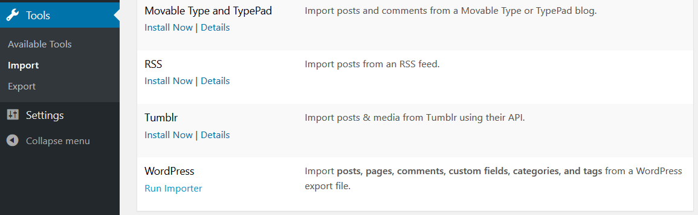
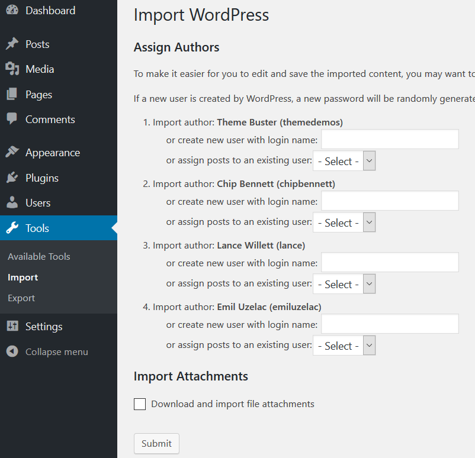
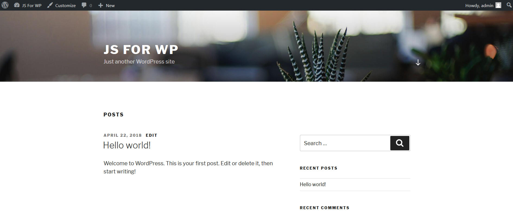
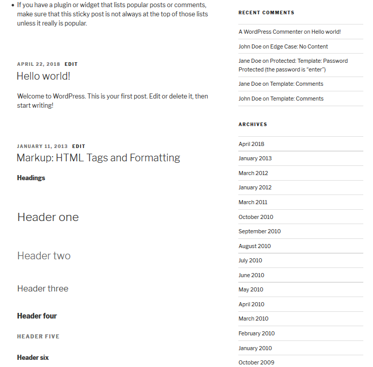

# Wordpress en javascript

Le principe de ce dépot est de voir comment faire du développement Wordpress avec du javascript.

Wordpress est un gestionnaire de contenu (C.M.S.) hautement personalisable et extensible via:

- les thèmes qui modifient le visuel
- les plugins (ou extensions) qui rajoutent des fonctionalités

Le coeur de Wordpress est à la base écrit en PHP, mais depuis quelques année, face à l'engouement des développeurs pour javascript et surtout aux possibilités offertes par ce dernier depuis sa version ES6, de nombreuses initiatives JS sur wordpress voient le jour dont notamment Calypso (l'interface d'adinistration sur worpress.com) et l'éditeur SPA "Gutenberg".

Il est par défaut possible d'insérer du code javascript dans votre thème ou dans la zone d'administration via les fonctions php suivantes:

- `wp_enqueue_script()` (on y renseigne le nom du handle, le path vers le fichier, les dépendances ou encore les fichiers après lesqueles il doit être chargé, la version qui peut être changée pour reformuler le cache et un boolen qui dit si l'appel se fait de la footer/true ou dans le header/false de votre page)
- `wp_localize_script()` qui permet notamment de mettre à disposition des variables aux scripts

A propos du booléen final il s'agit de l'équivalent de `wp_head()` et `wp_footer()`

```
function hook_javascript() {
    ?>
        <script>
            alert('Page is loading...');
        </script>
    <?php
}
add_action('wp_head', 'hook_javascript');
```

Au niveau PHP, pour mettre a disposition d'un script les variables "nom" et "age" de l'admin (par exemple) mais également l'url et le nom de votre site, il faut faire ceci dans le fichier `functions.php`:

```
<?php

// Register the script
wp_register_script( 'monScript', 'path/to/myscript.js' );

// Localize the script with new data
$translation_array = array(
	'nom' => __( 'Benfarhay', 'plugin-domain' ),
	'age' => '40',
    'site_url' => esc_url(home_url()),
    'site_name' => get_bloginfo('name')
);
wp_localize_script( 'monScript', 'object_name', $translation_array );

// Enqueued script with localized data.
wp_enqueue_script( get_stylesheet_directory_uri().'monScript' );
```
qui seront récupérées comme suit:

```
<script>
alert( "Bonjour je m'appelle " + object_name.nom + " et j'ai " + parseInt( object_name.age, 10 ) + " ans");
</script> 

```
 
 Pour ajouter un hooks qui permettra d'inclure nos scripts il faudrait faire appel à la fonction `add_action()`

 ```
 function my_enqueue_scripts(){
     wp_enqueue_script();
     wp_localize_script();
 }

 add_action( 'wp_enqueue_scripts', 'my_enqueue_scripts')
 ```

# Preparation de l'environnement de travail

Pour une installation locale il y a deux méthodes plus ou moins simples qui dans tous les cas demandera au final de passer par une étape de déploiement afin de rendre votre site visible sur internet.

## Installation de Desktop Server

Si vous n'êtes pas à l'aise avec les notions de configuration apache et de mysql ou encore l'installation d'un serveur web et la création d'une base de donnée, alors via le site [serverpress.com](https://serverpress.com/) vous avez la possibilité après inscription de télécharger DesktopServer gratuitement (avec quelques options limités dont le support et le nombre de site gérable) et de tout simplement après décompression exécuter avec un utilisateur privilégié l'application DesktopServer se trouvant sous le répertoire libs.

## Installation d'un server web et de wordpress

L'autre méthode est d'installer un serveur web sur votre machine, il en existe plusieurs et tous ont au minimum 3 lettres qui devrait représenter 3 modules à savoir:
- A pour apache, celui qui intercepte les requêtes et renvoi la réponse
- M pour MySQL, celui qui s'occupe des bases de données, des droits d'accès aux données, etc...
- P pour PHP, celui qui s'occupera d'interprétet le code PHP
- Une lettre qui renseigne sur le système d'exploitation cible: W pour windows, L pour Linux et X pour Mac

Vous aurais par exemple les logiciels Wamp, Xamp ou Lamp, mais vous pouvez avoir d'autres lettres supplémentaires ou en échange permettant de dire par exemple que vous utiliserez les base de données de types PostGreSQL ou le language de programmation Perl, etc...

Après installation de votre serveur web et suite à son exécution vous devriez pouvoir accéder à l'URL http://127.0.0.1 ou son équivalent http://localhost via votre navigateur. 

Remarque: Si l'installation est faite sur une machine autre que votre machine locale alors il faudra changer 127.0.0.1 avec l'adresse IP de la machine ou l'installation a été faite ce qui peut être le cas si vous avez une seconde machine physique de développement ou virtuel (via Oracle VM VirtualBox ou VMware Workstation Player, ...)

Puis après avoir localisé le répertoire root (normalement appelé www) de votre serveur vous devez y décompresser le fichier wordpress télécharger [ici](https://wordpress.org/download/), si la décompression s'est faite sous le répertoire wordpress, alors vous devriez avoir les étapes d'installation via l'url http://localhost/wordpress. L'installation de wordpress prend moins de 5 minutes, elle se résmue à donner le nom de votre site, les identifiants de l'admnistrateur (nom, mot de passe et adresse email) et enfin les paramètres de votre base de données qui se trouver dans le fichier wp-config.php (que l'on copie depuis le fichier wp-config-sample.php). Le fichier wp-config.php doit contenir les informations de la base de données que vous pouvez créer manuellement via des requêtes mysql  pour [créer la base](https://dev.mysql.com/doc/refman/5.7/en/creating-database.htmlà, l'[utilisateur](https://dev.mysql.com/doc/refman/5.7/en/create-user.html) et lui [donner les privilèges necessaires](https://dev.mysql.com/doc/refman/5.7/en/grant.html):

```
mysql> CREATE DATABASE wordpress;
mysql> CREATE USER 'newuser'@'localhost' IDENTIFIED BY 'password';
mysql> GRANT ALL PRIVILEGES ON worpress.* TO 'newuser'@'localhost'
mysql> FLUSH PRIVILEGES;
```

ou en vous connectant à phpmyadmin qui vous offre une interface visuelle simple à utiliser, vous aurez un résultat dans le fichier wp-config.php qui ressemble à ceci:

```
define('DB_NAME', 'NOM De La BASE DE DONNEE');
define('DB_USER', 'NOM DE L UTILISATEUR');
define('DB_PASSWORD', 'SON MOT DE PASSE');
define('DB_HOST', 'ADRESSE IP DE LA MACHINE EXECUTANT LE SERVEUR DE BASE DE DONNEE');
```

## Fichiers de travail

Les fichiers de notre installation sont dans 3 répertoire dont wp-content. Ce dernier est celui qui vous permettra d'étendre les fonctionalités de wordpress via les plugins (repertoire wp-content/plugins) ou de modifier l'apparence via les thèmes (repertoire wp-content/themes)

En tant que développeur vous aurez besoin d'avoir sur votre installation des données de travail (fake ou dummy data) permettant de [tester votre thème](https://codex.wordpress.org/Theme_Development#Theme_Testing_Process), il existe un fichier dit Thème Unit Test Data qui est un [fichier XML](https://raw.githubusercontent.com/WPTRT/theme-unit-test/master/themeunittestdata.wordpress.xml) dit WordPress eXtended RSS ayant un format particulier et compréhensible par wordpress (WXR), vous pouvez importer ce fichier via tools > import > WordPress Si vous ne voyez pas de lien vers "Run Importer" cliquer sur "Install Now" près de Wordpress pour installer le module d'import.
En cliquant sur Run importer vous avez juste a sélectionner le fichier xml téléchargé et cliquer sur le bouton "import file and import". Puisque le fichier comportera des articles, il vous sera demander si vous voulez automatiquement créer les noms des auteurs trouvés dans le fichier XML ou d'utiliser un des utiliateurs existant dans votre installation. Puis vous pouvez également importer les attachements (lien vers un fichier externe) et au final valider en cliquant sur "submit"

 
 

 Ca nous permet ainsi de passer d'un site ne comportant qu'un seul article (le fameux Hello world!)
 
 

 à un site plus "complet" comportant des posts (articles), des pages, des commentaires,  des catégories, des tags (mots clés) mais également différentes éléments typographiques (listes, blockquotes, lien, titre h1, h2, h3, ..., des tableaux, ect ...) à plusieurs dates différentes
  
 
 
 > NB: La différence entre une page et un article c'est l'affectation d'un date. Si par exemple vous désirez créer un élément qui présentera une société ou fournira les éléments de contacts, alors vous n'avez pas besoin d'y rajoutez la date de publication, on parle alors de page, si par contre vous désirez mettre en ligne un autre élément qui parle d'une formation, d'un séminaire, d'une activité entre les développeurs de la société ou alors d'une présentation d'un technologie ou solution, il serait bon d'y rajouter la date de publication, parce que les évenements ont une date mais les technologies en ont une indirectement. Qui n'a pas consulté un site discutant par exemple de ReactJS ou PHP sans consulter la date de publication histoire de savoir si c'est toujours d'actualité ou si ce qui est inscrit est déprécié?

 # Les thèmes

 ## création d'un thème

 Créons notre premier thème en nous basant sur cette [page](https://codex.wordpress.org/Blog_Design_and_Layout) du Codex de wordpress

 Les fichiers de notre thèmes seront dans un répertoire sous wp-content/themes/, créeons donc notre thème que vous appelerez comme vous voulez (nom de votre société, sujet du thème, nom propre à votre thème en tant que produit, etc...), dans mon cas je vais simplement l'appeler "Tunisia"
 
 il doit avoir bien sur un style (style.css) des fichier de template en php (qui contrôle comment le contenu des pages seront générés) et le fichier functions.php (qui permet de controler les fonctionalités du thème)

 Les détails du thème seront inclus en tant que commentaires dans le fichier style.css, par exemple:

 /*
Theme Name:Tunisia
Author: Benfarhat Elyes
Author URI: https://github.com/Benfarhat
Description: Wordpress for JS developper
Version: 1.0
License: GNU General Public License v2 or later
License URI: http://www.gnu.org/licenses/gpl-2.0.html
Tags: javascript, reactjs
Text Domain: tunisia

This theme, like WordPress, is licensed under the GPL.
Use it to make something cool, have fun, and share what you've learned with others.
*/

Il est également possible d'avoir un fichier screenshot.png qui vous permettra d'avoir un apercu du thème via le panneau d'administration. 

Par defaut il nous faut un fichier index.php, il peut contenir l'ensemble du code générant les pages de votre site MAIS... a moins de faire un site vitrine contenant des informations très basic (comme l'adresse et l'email de contact), il vaut mieux subdiviser votre site en partie. Si vous avez fait du React, cela ressemble fortement au subdivision pour avoir un composant qui s'occupe du header, un autre du footer, l'autre de la sidebar etc ..

Vous pouvez dans votre fichier index.php mettre ceci:

```
<!DOCTYPE html>
<html lang="en">
<head>
    <meta charset="UTF-8">
    <meta name="viewport" content="width=device-width, initial-scale=1.0">
    <meta http-equiv="X-UA-Compatible" content="ie=edge">
    <title>Tunisia</title>
</head>
<body>
    Bienvenue
</body>
</html>
```
en activant ce thème vous aurez une page vide contenant le mot "Bienvenue"
